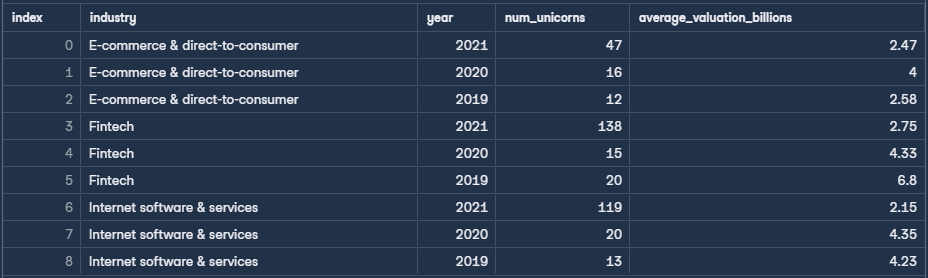

# Analyzing Unicorn Companies & High-Growth Industry Trends


## 📌 Executive Summary
An investment firm required visibility into high-growth industry trends to guide upcoming portfolio allocation strategies. Specifically, leadership wanted to identify which sectors generated the largest volume of high-value companies between **2019 and 2021**, tracking how their emergence rates and average market valuations evolved year-over-year.

Using multi-table relational queries, **Common Table Expressions (CTEs)**, and date extraction, this analysis isolated the top three performing industries—**Fintech**, **Internet software & services**, and **E-commerce & direct-to-consumer**—and quantified their growth trajectory across a multi-year window.

---

## 📂 Data Schema
The analysis was performed on the `unicorns` relational database comprising four entities linked by `company_id`:

* **`dates`**: Records `company_id`, `date_joined`, and `year_founded`.
* **`funding`**: Contains financial metrics including `valuation`, `funding`, and `select_investors`.
* **`industries`**: Maps each `company_id` to its operational `industry`.
* **`companies`**: Holds company name and geographic dimensions (`city`, `country`, `continent`).

---

## 🛠️ Technical Implementation & SQL Concepts
The query implements several core relational database concepts:
* **Common Table Expressions (CTEs)**: Modularized logic separating top industry identification from multi-year metric aggregation.
* **Multi-Table Joins**: Linked `industries`, `dates`, and `funding` across foreign key relationships.
* **Date Manipulation**: Applied `EXTRACT(YEAR FROM ...)` to normalize timestamps into comparative calendar years.
* **Aggregation & Unit Scaling**: Converted raw valuations into billions (`/ 1,000,000,000.0`) rounded to two decimal places while applying `COUNT(DISTINCT ...)`.

```sql
WITH top_industries AS (
    SELECT 
        i.industry
    FROM industries i
    JOIN dates d ON i.company_id = d.company_id
    WHERE EXTRACT(YEAR FROM d.date_joined) IN (2019, 2020, 2021)
    GROUP BY i.industry
    ORDER BY COUNT(DISTINCT d.company_id) DESC
    LIMIT 3
),
yearly_metrics AS (
    SELECT 
        i.industry,
        EXTRACT(YEAR FROM d.date_joined) AS year,
        COUNT(DISTINCT d.company_id) AS num_unicorns,
        ROUND(AVG(f.valuation) / 1000000000.0, 2) AS average_valuation_billions
    FROM industries i
    JOIN dates d ON i.company_id = d.company_id
    JOIN funding f ON i.company_id = f.company_id
    WHERE EXTRACT(YEAR FROM d.date_joined) IN (2019, 2020, 2021)
      AND i.industry IN (SELECT industry FROM top_industries)
    GROUP BY i.industry, year
)
SELECT 
    industry,
    year,
    num_unicorns,
    average_valuation_billions
FROM yearly_metrics
ORDER BY industry, year DESC;

```

---

## 📊 Query Output



*Figure 1: Query Output — Top 3 Industries with Yearly Unicorn Counts and Average Valuation ($B) (2019–2021).*

---

## 🔍 Key Strategic Insights
1. **The 2021 Influx**: The creation of unicorns accelerated rapidly in 2021 across all top three industries, with **Fintech (138)** and **Internet software & services (119)** leading new market entrants.
2. **Valuation Normalization**: While 2021 added the highest volume of high-growth companies, average valuations decreased (e.g., Fintech averaged **$6.80B in 2019** vs. **$2.75B in 2021**), reflecting an influx of early threshold-crossing unicorns rather than established mega-cap valuations.
3. **Portfolio Recommendation**: Allocate capital heavily toward Fintech and B2B Software infrastructure, while auditing entry valuations to account for compressed multiples post-2020.

---
*© 2026 Ryan Tang.*
